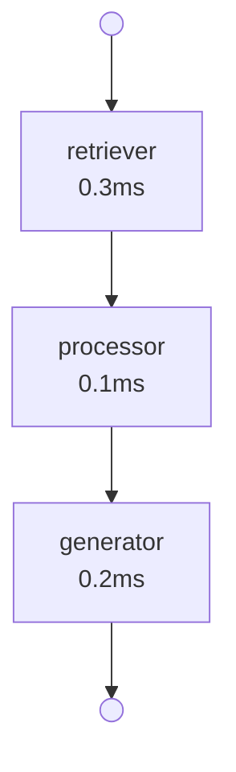

# agentrace

[](https://github.com/sanmingar1/agentrace/actions/workflows/ci.yml)
[](https://pypi.org/project/agentrace/)
[](LICENSE)
[](https://github.com/astral-sh/ruff)

Debug & trace library for LangGraph agents. Capture, analyze, and visualize what your agent does — node by node, edge by edge.

**Zero network calls. Zero paid APIs. Pure Python.**

## Quick Start

```bash
pip install -e .
```

### 1. Wrap your agent (1 line)

```python
from agentrace import wrap

traced = wrap(your_compiled_graph)
result = traced.invoke({"query": "Hello"})
trace = traced.last_trace
```

### 2. Print a rich terminal report

```python
from agentrace import print_trace

print_trace(trace)                # summary view
print_trace(trace, detailed=True) # with state diffs
```

Output:
```
╭──────────────────── agentrace ─────────────────────╮
│ ├── OK Step 1: retriever (0.3ms)                    │
│ ├── OK Step 2: processor (0.1ms)                    │
│ └── OK Step 3: generator (0.2ms)                    │
╰────────────── SUCCESS | 3 nodes | 1.2ms ───────────╯
```

### 3. Assert agent behavior

```python
from agentrace import assertions

assertions.node_was_visited(trace, "retriever")
assertions.node_was_not_visited(trace, "fallback")
assertions.node_visited_before(trace, "retriever", "generator")
assertions.edge_taken(trace, "retriever", "processor")
assertions.no_errors(trace)
assertions.total_nodes_visited(trace, min=3, max=5)
assertions.state_at_node(trace, "retriever", lambda s: len(s["documents"]) > 0)
assertions.max_duration(trace, "llm_call", ms=5000)
```

### 4. Generate Mermaid diagrams

```python
from agentrace import to_mermaid

print(to_mermaid(trace))
# or
print(trace.to_mermaid())
```



### 5. Use with pytest

agentrace includes a pytest plugin with fixtures:

```python
def test_my_agent(traced_agent):
    from agentrace import assertions

    traced = traced_agent(my_compiled_graph)
    traced.invoke({"query": "test"})
    trace = traced.last_trace

    assertions.node_was_visited(trace, "retriever")
    assertions.no_errors(trace)
```

## Features

| Feature | Status |
|---------|--------|
| Stream-based capture (`capture()`) | Done |
| Callback-based tracing (`wrap()`) | Done |
| Pydantic Trace models | Done |
| State diffs per node (deepdiff) | Done |
| Rich terminal reporter | Done |
| Mermaid diagram generator | Done |
| 8 assertion functions | Done |
| pytest plugin (fixtures + markers) | Done |
| HTML reporter | Planned |
| JSON/JUnit reporters | Planned |
| CI/CD integration | Planned |

## What makes it different

| Feature | LangSmith | Langfuse | agentrace |
|---------|-----------|----------|-----------|
| Graph-aware (nodes/edges) | Partial | No | **Yes** |
| Offline / no server | No | No | **Yes** |
| Free | No | Self-host | **Yes** |
| Visual graph output | Studio | No | **Terminal/Mermaid** |
| State diff per node | No | No | **Yes** |
| Assertion framework | No | No | **Yes** |

## Project Status

- **104 tests passing** | **90% code coverage**
- Phase 1 (PoC): Done
- Phase 2 (Callbacks): Done
- Phase 3 (MVP): In progress
- Current version: 0.1.0-dev

## Tech Stack

Python 3.10+ | Pydantic v2 | Rich | deepdiff | LangGraph | pytest

## Examples

See the `examples/` directory:
- `simple_chatbot.py` — Basic 3-node chatbot with tracing
- `rag_with_routing.py` — RAG agent with conditional routing

---

*Built by Santiago Minarro Garcia, February 2026*
